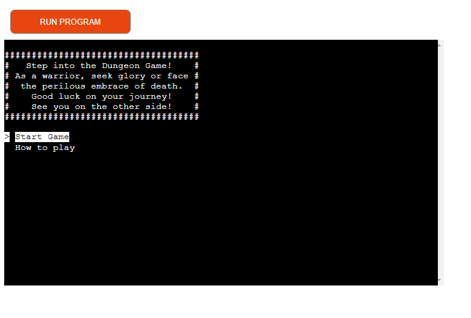
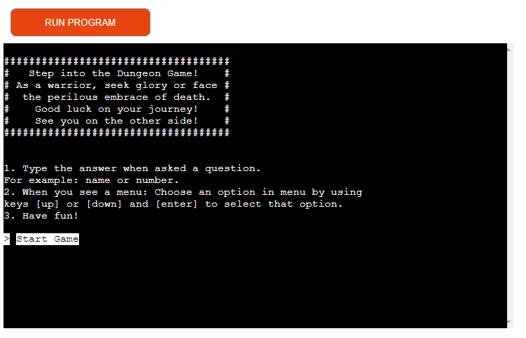
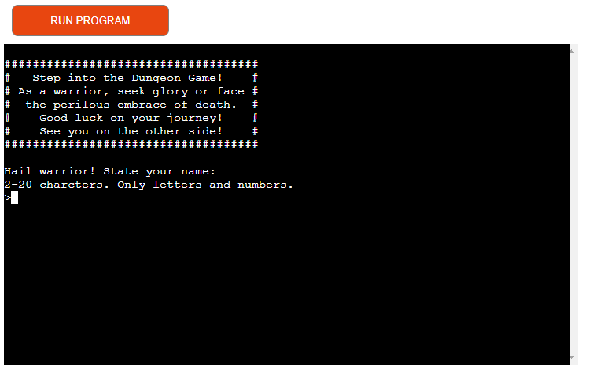
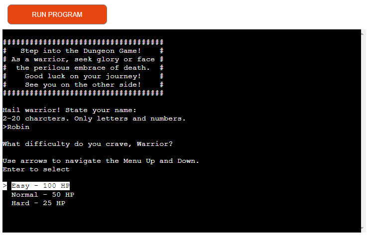
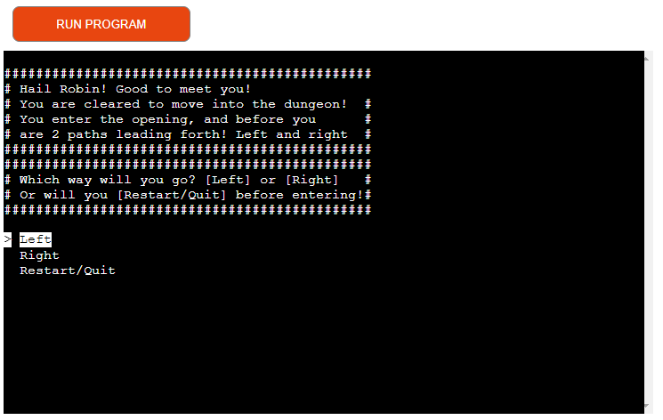
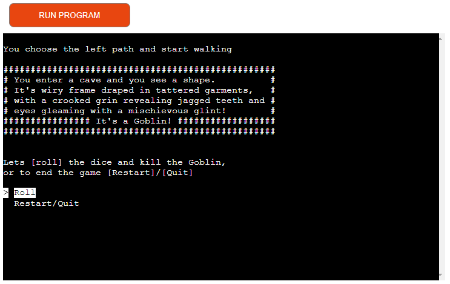
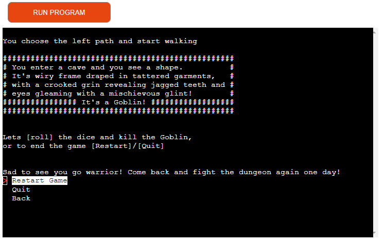
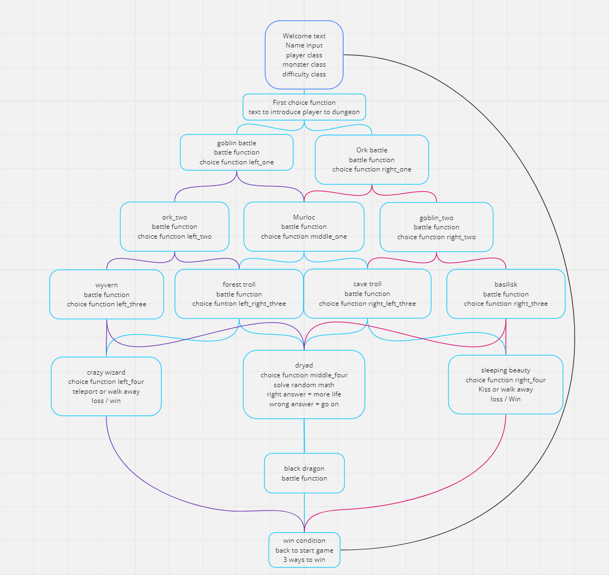
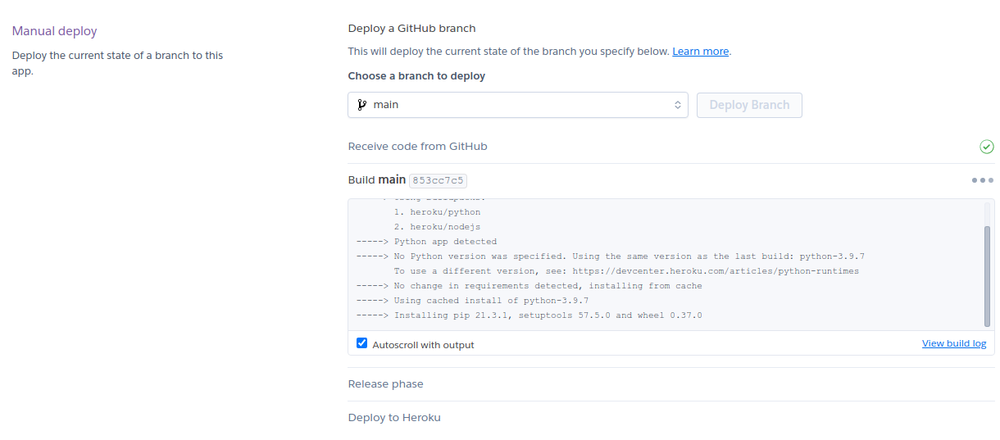

# Dungeon-text-game


Click this *[link](https://dungeon-text-game-8f6df9144d01.herokuapp.com/)* to get to the game

---

## Overview

Dungeon Text Game is a Python terminal project designed to offer an engaging and entertaining experience while also serving as a platform for decision-making practice. The primary goal is to boost users' moods through an interactive game with various story outcomes.

---

## Purpose

The project aims to achieve the following objectives:

1. **User Engagement:** Provide users with an enjoyable and interactive text-based gaming experience.
2. **Decision-Making Practice:** Allow users to practice decision-making skills through the choices presented in the game.
3. **Ease of Use:** Ensure that the game is easy to understand, navigate, and play.

---

## How to play:

  1. Click this *[link](https://dungeon-text-game-8f6df9144d01.herokuapp.com/)* or copy this text: `https://dungeon-text-game-8f6df9144d01.herokuapp.com/` and paste it into your browser's address bar.
  2. As the page is loaded, click 'Start Game' or 'How to play'.
  3. Introduce yourself to the program.
  4. Choose the difficulty.
  5. Read the decisions and choose how to move forward.
  6. Play one more time and try to enter different choices to have a different outcome.
  7. As soon as you are sick and tired of the game, choose "Quit" and **send** the link to this program to your friends!

  Link to the game: *https://dungeon-text-game-8f6df9144d01.herokuapp.com/*

---
## User Stories
### First Time Visitor Goals:

* As a First Time Visitor, I want to quickly understand the program's primary purpose so that I can start to play.
* As a First Time Visitor, I want to navigate through the program easily so that I can move true the game.
* As a First Time Visitor, I want to relax and have fun playing the game.

### Frequent Visitor Goals:
* As a Frequent User, I want to be able to find different paths true the game.
* As a Frequent User, I want the stories to be a bit different to have new experiences. 

---

## Features
  
  - **When the program is loaded**

  - The user can see a welcoming message with options(menu) to 'start game' or 'How to play'.
  - The user can manipulate the terminal menu with the arrow keys to choose an option and the enter key to confirm the choice.

  

  - **When the user chooses 'How to play'.**
  - How to play:
  
      1. Type the answer when asked a question. For example: name or number.
      2. When you see a menu: Choose an option in the menu by using keys [up] or [down] and [enter] to select that option.
      3. Have fun!

      * Start Game(menu) - to start the game.

    

  - **When the user chooses 'Start Game'.**
  - Message asking for the name(input) of user in 2- 20 characters(letters and numbers accepted)

  

  - **Then the user is asked what difficulty(menu) to play at.**
  - Difficulty menu: 

      * Easy 100 health points.
      * Normal 50 health points.
      * Hard 25 health points.

    

  - **Then the user gets a welcome text with a name and a choice(menu)**

  - Shows the terminal menu with two options:
  
      1. Left - Take the left choice
      2. Right - Take the right choice
      3. Restart/Quit 
        - The program will show the sub-menu with the following options to choose from:
          1. Restart Game. - Restart the game.
          2. Quit - End game.
          3. Back - Go back to the left/right choice. (Option don't show if dead or reached the last function)

      

  - **When the user chose 'left'**
  - Show text explaining the user 'start walking left' then coming to a room/cave and a monster is waiting there. 
  - Show a description of the cave and monster
  - A battle choice [roll] to attack or [Restart/Quit] to end the game
    
    1. roll:
      - random number generated between 1-6 and use that number as an attack for the user and a random 1-6 number for the monster to attack the user with.

    

    2. Restart/Quit
      - The program will show the sub-menu with the following options to choose from:
        1. Restart Game. - Restart the game.
        2. Quit - End game.
        3. Back - Go back to the left/right choice.(Option don't show if dead)
    
    

---

## Flowchart

The flowchart represents the logic of the application:

  

---

## Technologies Used

### Languages:

- [Python 3.8.5](https://www.python.org/downloads/release/python-385/): used to anchor the project and direct all application behavior

- [JavaScript](https://www.javascript.com/): used to provide the start script needed to run the Code Institute mock terminal in the browser

- [HTML](https://developer.mozilla.org/en-US/docs/Web/HTML) is used to construct the elements involved in building the mock terminal in the browser

### Frameworks/Libraries, Programmes and Tools:
#### Python modules/packages:

##### Standard library imports:

- [random](https://docs.python.org/3/library/random.html) was used to implement pseudo-random number generation.
- [os](https://docs.python.org/3/library/os.html ) was used to clear the terminal before running the program and some functions.
- [sys](https://docs.python.org/3/library/sys.html) was used to make the exit and restart the terminal.
##### Third-party imports:

- [Simple Terminal Menu](https://pypi.org/project/simple-term-menu/) was used to implement the menu.

#### Other tools:

- [VSCode](https://code.visualstudio.com/) was used as the main tool to write and edit code.
- [Git](https://git-scm.com/) was used for the version control of the website.
- [GitHub](https://github.com/) was used to host the code of the website.
- [Photoshop](https://www.adobe.com/se/products/photoshop.html) was used to make and resize images for the README file.
- [miro.com](https://www.miro.com/) was used to make a flowchart for the README file.
- [heroku.com](https://heroku.com/) was used to deploy the project.


---

## Solved bugs

1. Function difficulty did not work

    *Solutions*: add "()" after lower in the input line: `input('>').lower()`.
2. The Game did not find player value

    *Solutions*: moved 

    ```python
    player_name = get_player_name(),
    player_hp = difficulty(),
    player = Player(player_name, player_hp)
    ```

    to `main_game` function so it was called in the right order.

3. Error in code from diceroll.py
    
    *Solutions:* deleted 4 spaces so 

    `print(f"""Lets [roll] the dice and kill the {monster.name}, 
    or to end the game [Restart]/[Quit]\n""")`
    
    was on the right line.

4. The restart function did not work correctly,

    code line: `os.execl(sys.executable, os.path.abspath("run.py"), *sys.argv)`
    
    *Solutions:* change the line 
    `os.path.abspath("run.py")` 
    to `sys.executable`

    * Bugg came because simple_term_menu and os/sys interfered with each other somehow. 

**Unsolved bugs**

- No unsolved bugs

---

## Testing

Please refer to the [TESTING.md](TESTING.md) file for all test-related documentation.

---

## Deployment

- The program was deployed to [Heroku](https://dashboard.heroku.com).

### To deploy the project as an application that can be **run locally**:

*Note:*
  1. This project requires you to have Python installed on your local PC:
  - `sudo apt install python3`

  1. You will also need pip installed to allow the installation of modules the application uses.
  - `sudo apt install python3-pip`

Create a local copy of the GitHub repository by following one of the two processes below:

- Download ZIP file:
  1. Go to the [GitHub Repo page](https://github.com/NiborGnu/dungeon-text-game).
  1. Click the Code button and download the ZIP file containing the project.
  1. Extract the ZIP file to a location on your PC.

- Clone the repository:
  1. Open a folder on your computer with the terminal.
  1. Run the following command
  - `git clone https://github.com/NiborGnu/dungeon-text-game.git`

### To deploy the project to Heroku so it can be run as a remote web application:
- Clone the repository:
  1. Open a folder on your computer with the terminal.
  1. Run the following command
  - `git clone https://github.com/NiborGnu/dungeon-text-game.git`

  1. Install Python module dependencies:
     
      1. Navigate to the folder dungeon_text_game by executing the command:
      - `cd dungeon_text_game`
      1. Run the command pip install -r requirements.txt
        - `pip3 install -r requirements.txt`

  1. Create your own GitHub repository to host the code. 
  1. Run the command `git remote set-url origin <Your GitHub Repo Path>` to set the remote repository location to your repository.

  1. Push the files to your repository with the following command:
  `git push`
  1. Create a Heroku account if you don't already have one here [Heroku](https://dashboard.heroku.com).
  1. Create a new Heroku application on the following page here [New Heroku App](https://dashboard.heroku.com/apps):

      - 

  1. Go to the Deploy tab:

      - 

      - 

  1. Link your GitHub account and connect the application to the repository you created.

      - 

  1. Go to the Settings tab:
  
      - 

  1. Click "Add buildpack":

      - 

  1. Add the Python and Node.js build packs in the following order:

      - 

  1. Click "Reveal Config Vars."

      - 

  1. Add 1 new Config Vars:
      - Key: PORT Value: 8000
      - *This Config was provided by [CODE INSTITUTE](https://codeinstitute.net/)*.

  1. Go back to the Deploy tab:

      - 

  1. Click "Deploy Branch":

      - 

      - Wait for the completion of the deployment.

      - 

  1. Click "Open app" to launch the application inside a web page.

      - 

---

## Credits
- The text in the game is all made up by myself.
- Terminal menu: [Simple Terminal Menu](https://pypi.org/project/simple-term-menu/).
- Thank [Code Institute](https://learn.codeinstitute.net/) for all the nice tutorials and tips. And for giving Heroku time.
- [heroku.com](https://heroku.com/) for hosting the application.
- The code for [clean_screen](https://stackoverflow.com/questions/2084508/clear-terminal-in-python) function. OBS! The answer from **poke** is where I found the code. OBS!

---
