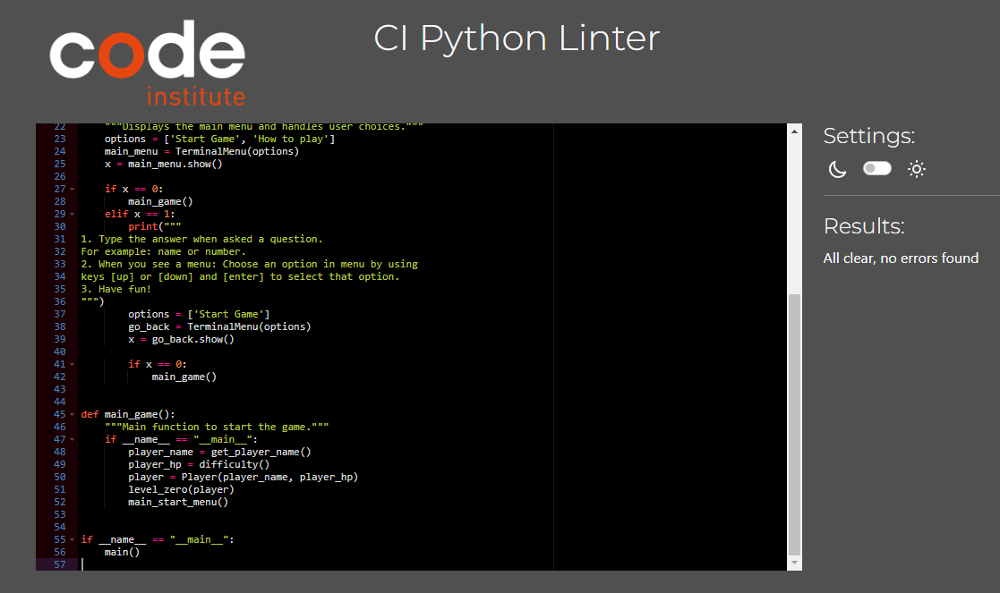
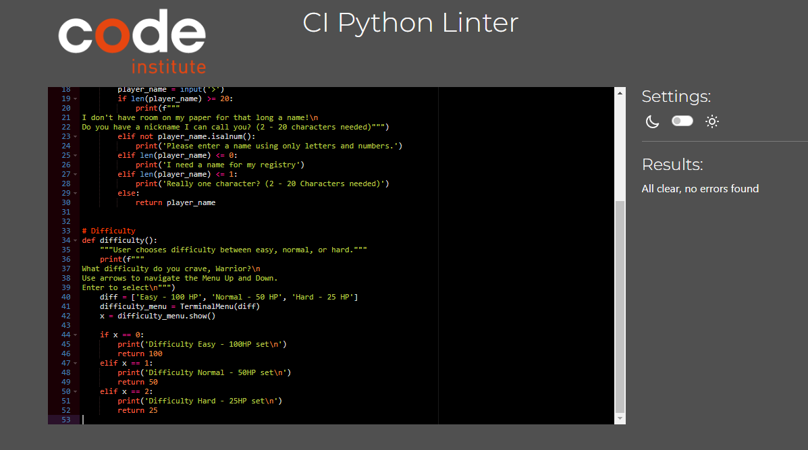
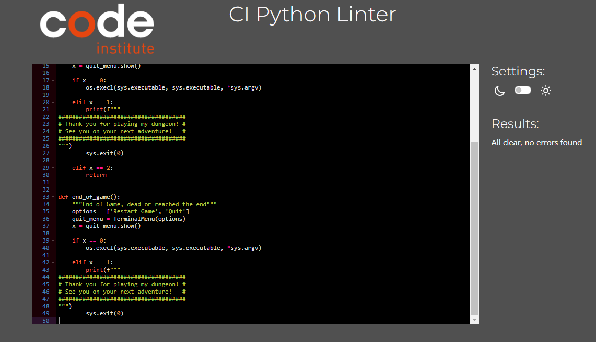
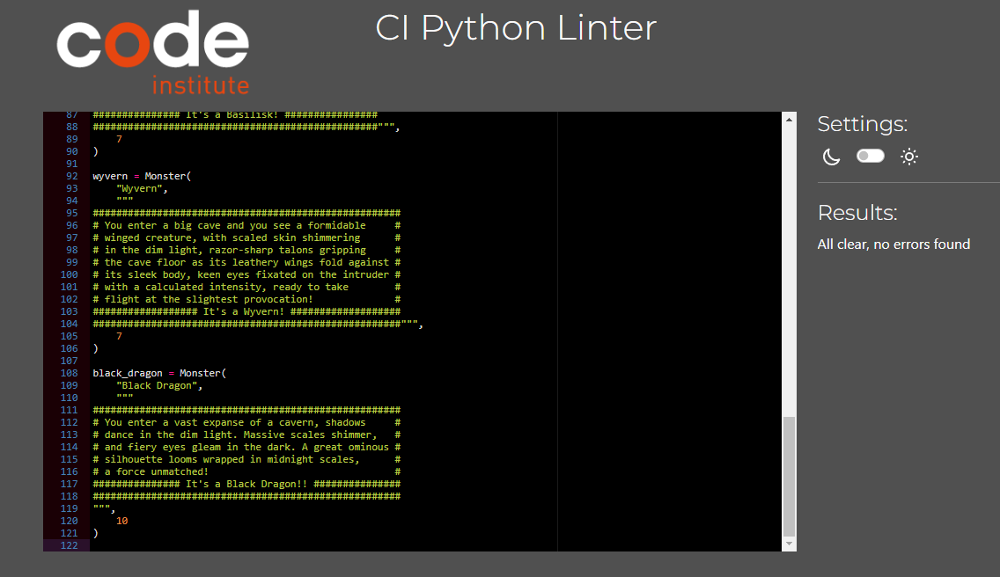
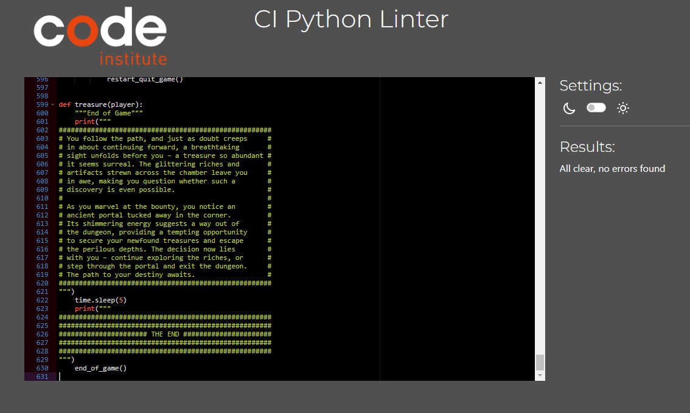
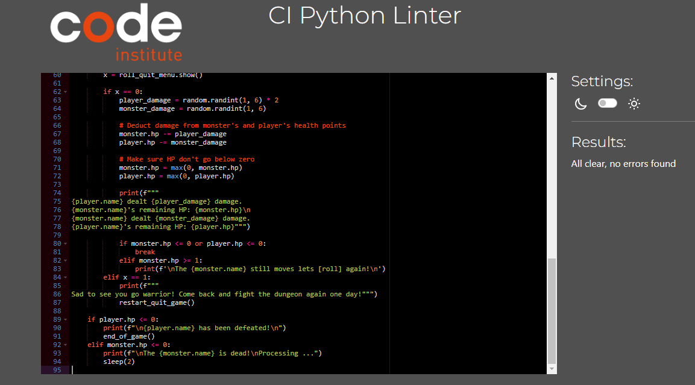

Return to the [README.md](README.md) file.

## Testing

The program was tested constantly during its development process.
Other users also tested it to spot possible grammatical mistakes that the code may present.

### Validators

Valentin Bryukhanov's [online validation tool](http://pep8online.com/) was used to ensure that all of the project's Python source code is [Pep 8-compliant](https://legacy.python.org/dev/peps/pep-0008/). This checking was done manually by copying python code and pasting it into the validator.

No errors were found:

- **run.py**

- **player.py**

- **os_interaction.py**

- **monster.py**

- **game_paths.py**

- **diceroll.py**

## Issues with validating the code

I want to give a warning that:
The validator may show that there is a missing line at the end of the code in some files
and that GitHub does not show the last empty lines in all files.